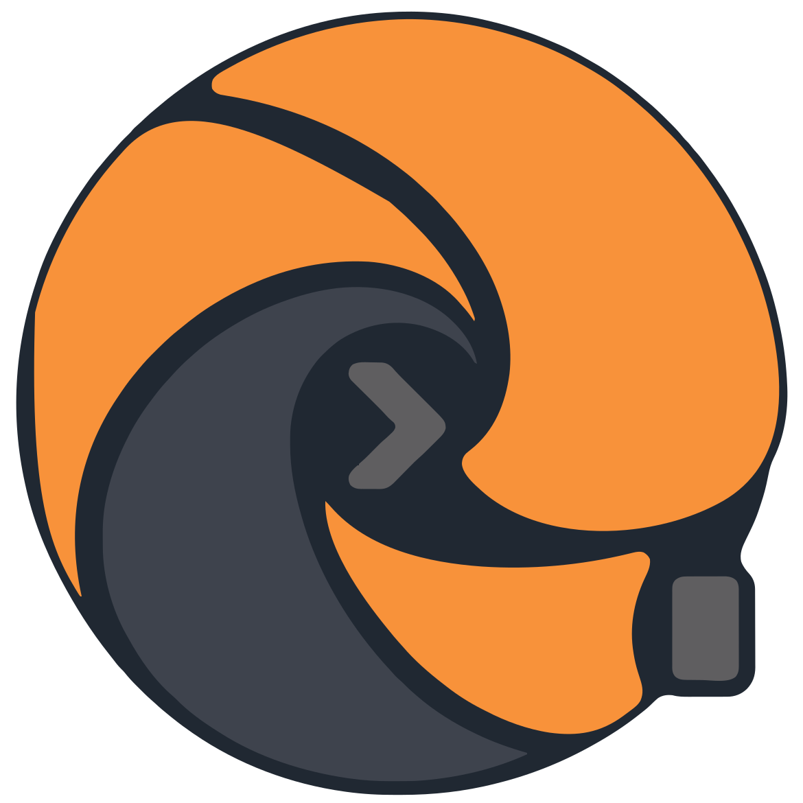
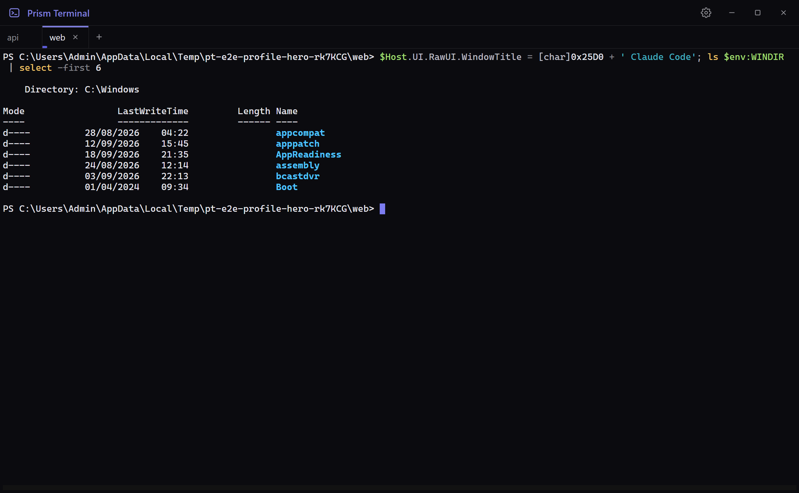
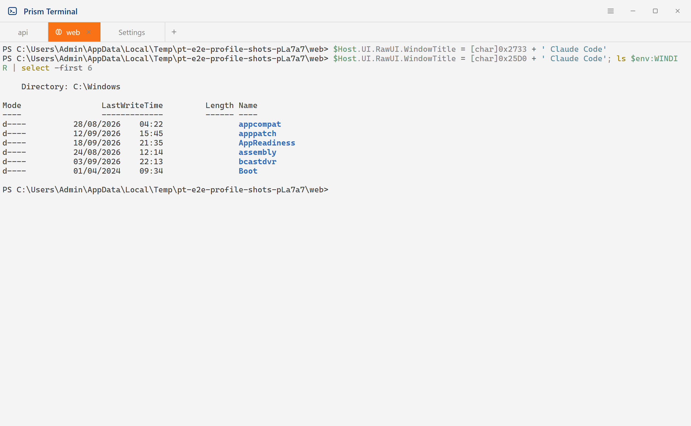
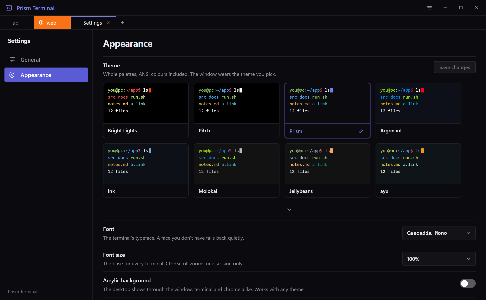

<div align="center">
  

  # Prism Terminal

  Made for working with agents.

  A tabbed Windows terminal built for AI CLIs.

  [](https://github.com/Maxaubert/PrismTerminal/releases/latest)
  [](https://github.com/Maxaubert/PrismTerminal/releases)
  [](#build-from-source)
  [](LICENSE)

  [Download](https://github.com/Maxaubert/PrismTerminal/releases/latest) · [Build from source](#build-from-source)
</div>

---

https://github.com/user-attachments/assets/23c7ecde-a465-4d66-8b8b-8b523e2e0218

Prism Terminal is the terminal from [Prism](https://github.com/Maxaubert/Prism), lifted out into an
app of its own. It is for people who keep Claude Code or Codex running in several folders at once
and want to know, at a glance, which one has finished.

## What it does

- **An agent indicator on every tab.** A tab lights while Claude Code or Codex is working. It reads
  the agent's own word (the state each CLI writes into the terminal title), so it lights within
  milliseconds of Enter and clears the instant the answer lands, where a terminal that scores output
  is a second or two late at both ends. It wears the theme's accent, as a quiet line under the tab
  or, turned up, the whole tab filled, which then also holds a "finished" colour until you visit it.
- **Dictation, on your own machine.** Turn it on in Settings, hold `Right Alt` and speak: the words
  land at the cursor when you let go, in any tab and any shell. It is
  [whisper.cpp](https://github.com/ggml-org/whisper.cpp) running locally, so your voice never leaves
  the PC and it works offline. A pill shows a live level meter and the text as you speak, so a muted
  microphone is obvious at once, not after a lost sentence. It never presses Enter for you. Pick a
  model in Settings (Base runs well on any CPU; with an NVIDIA card one click adds the GPU engine and
  the large models answer in under a second), a language or auto-detect, and optionally pause your
  music while you talk. Off until you switch it on: nothing listens and nothing downloads before that.
- **Command help, one key away.** Press `F1` (or the ? in the title bar) and describe what you want
  in your own words: "find big files", "what is using port 3000", "undo last commit". A few hundred
  everyday commands for PowerShell, Command Prompt and Bash, plus Git, Claude Code, Codex, winget,
  npm and pip, each with a plain explanation, its variations, what the placeholders mean and a
  warning on anything that deletes or overwrites. Every command has a copy button. It opens on the
  shell of the tab in front, works offline (the list ships with the app, no model and no network),
  and it never types or runs anything: you copy, you paste, you press Enter. Optional: Settings >
  General > Command help.
- **Tabs that come back.** Close the app and reopen it: every tab returns in the folder its shell
  was in, and a tab that hosted Claude or Codex resumes that conversation (`claude --resume <id>`,
  `codex resume --last`).
- **The theme is the window.** About forty terminal themes, a custom-theme editor, fifteen fonts.
  The title bar, tabs, menus and settings take their colours from the terminal theme you pick, and
  every colour is checked against a contrast floor, so no theme can make an unreadable window.
  Acrylic works with any of them, with an opacity slider. The lines between the parts of the window,
  and the border round it, are yours to set: hairline, faint, solid, or none.
- **Open a tab where you are.** "Open terminal here", with the app's icon beside it, on a folder and
  on the empty space inside one, in Explorer's right-click menu. If the app is running, the folder
  arrives as a new tab in its window.
- **New tabs your way.** The + opens in your user folder, or in one folder you choose, or asks each
  time. Right-click the + for pinned and recent folders.
- **Links look like links.** A URL printed in the terminal is highlighted and underlined all the
  time, not only under the pointer, and a click opens it. The colour is blue, moved as far as your
  theme's background needs for it to stay readable, custom backgrounds included.
- **Made for the way AI CLIs are used.** An image on the clipboard pastes into Claude Code, copied
  files paste as quoted paths, a file dropped on the window types its path, Shift+Enter is a
  newline, and Ctrl+C over a selection copies instead of interrupting.
- **It asks before it interrupts.** Closing a tab that hosts an agent asks first, and says which
  agent and how long it has been working; a plain shell just closes. Not a setting: it simply does
  the sensible thing.
- **Updates tell you what is in them.** When a newer release exists, an Update button appears in
  the title bar. Click it and a window lists what changed, with Cancel and Install. Nothing is
  downloaded until you choose Install; the button then fills as the download runs, and the app
  restarts into the new version. If an agent is mid-answer it asks first, since installing
  restarts the app. To see the button and its window without waiting for a release, start the app
  with `--preview-update`: it shows a made-up update, touches neither the network nor any
  installer, and says so when its pretend install finishes.

<div align="center">



</div>

## Install

Download `PrismTerminal-Setup-x64-<version>.exe` from
[Releases](https://github.com/Maxaubert/PrismTerminal/releases) and run it. It installs per user,
with no administrator prompt.

> [!NOTE]
> The installer is **unsigned**, so Windows SmartScreen will warn on first run: choose
> "More info", then "Run anyway". Windows 10 1809 or newer, x64. Acrylic needs Windows 11.

Closing the window quits, and everything open comes back at the next launch. Closing the last tab
lands on a start screen with the folders you were last in, each one press from a shell.

## Keys

| Key | Does |
|---|---|
| `Ctrl+T` | New tab |
| `Ctrl+W` | Close tab |
| `Ctrl+Tab` / `Ctrl+Shift+Tab` | Next / previous tab |
| `Ctrl+1` to `Ctrl+9` | Jump to a tab |
| `Ctrl+Shift+F` | Find in the scrollback |
| `Ctrl+,` | Settings |
| `Ctrl+scroll` | Zoom this tab's text |
| `F11` | Fullscreen |
| `F1` | Command help (when switched on; off, the key is the shell's again) |
| hold `Right Alt` | Dictate (when switched on; rebindable, or press-to-toggle) |

Everything else belongs to the shell: `Escape` is still vim's, and `Ctrl+Backspace` deletes a word
(`Ctrl+W` closes the tab, as it does in a browser).

## Shells

PowerShell 7, Windows PowerShell, Command Prompt and every installed WSL distro, whichever the
machine has. Pick the one new tabs use in Settings. PowerShell and cmd report their folder at every
prompt, which is what names the tab; a WSL tab keeps the folder it opened in.

## Build from source

```bash
npm install
npm run fetch:bin  # the speech engine, once (pinned by SHA-256; e2e and package run it too)
npm run dev        # run it
npm test           # unit tests (vitest)
npm run e2e        # drives the built app, parked offscreen and unfocused
npm run package    # dist/PrismTerminal-Setup-x64-<version>.exe
```

Electron, React 19, TypeScript, Vite, Tailwind v4, [xterm.js](https://xtermjs.org) and
[node-pty](https://github.com/microsoft/node-pty). Dictation is [whisper.cpp](https://github.com/ggml-org/whisper.cpp)'s
official Windows build (MIT), fetched at build time and shipped beside the app. Design notes live in
[`docs/superpowers`](docs/superpowers).

## License

[MIT](LICENSE)
